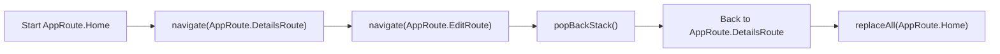
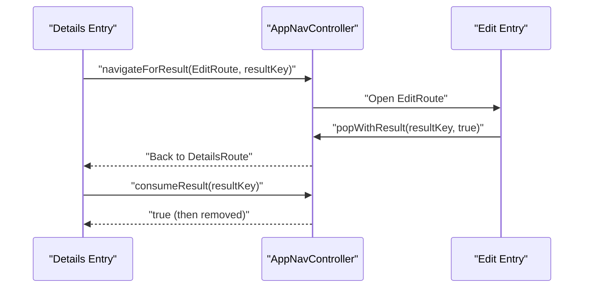
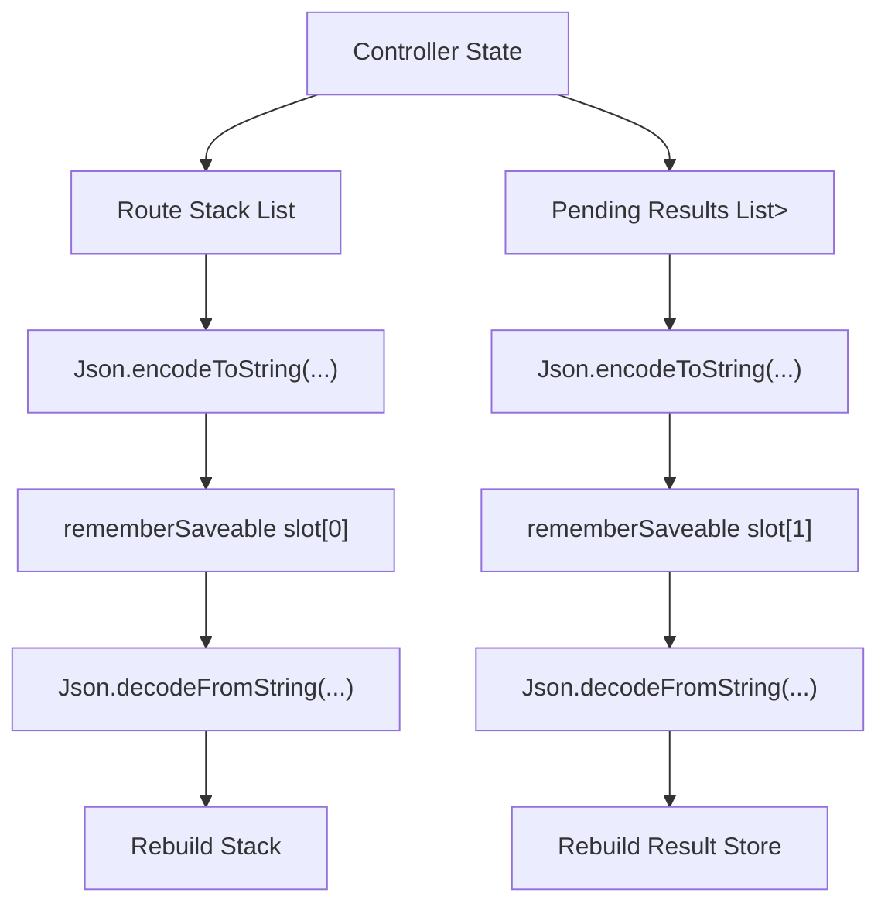

# Navigation3 Integration Guide (Standalone)

This document is a standalone manual for implementing a typed Navigation3 stack in an Android Compose application.

## 1) Dependencies

Add Navigation3 runtime, UI, ViewModel integration, and Kotlin serialization.

```kotlin
// build.gradle.kts (module)
plugins {
    id("com.android.application")
    kotlin("android")
    kotlin("plugin.serialization")
}

dependencies {
    implementation("androidx.navigation3:navigation3-runtime:<version>")
    implementation("androidx.navigation3:navigation3-ui:<version>")
    implementation("androidx.lifecycle:lifecycle-viewmodel-navigation3:<version>")
    implementation("org.jetbrains.kotlinx:kotlinx-serialization-json:<version>")
}
```

## 2) Route model

Define one serializable route root that implements `NavKey`.

```kotlin
import androidx.navigation3.runtime.NavKey
import kotlinx.serialization.Serializable

@Serializable
sealed interface AppRoute : NavKey {
    @Serializable
    data object Home : AppRoute

    @Serializable
    data class FeatureRoute(val id: Long) : AppRoute

    @Serializable
    data class DetailsRoute(val id: Long) : AppRoute

    @Serializable
    data class EditRoute(val id: Long) : AppRoute
}
```

## 3) Result primitives

Use a contract/key/store trio for typed one-shot result passing.

```kotlin
interface NavigationResultContract<T> {
    fun encode(value: T): String
    fun decode(raw: String): T
}

data class NavigationResultKey<T>(
    val id: String,
    val contract: NavigationResultContract<T>
)

class NavigationResultStore(
    private val backing: MutableMap<String, String> = mutableMapOf()
) {
    fun put(id: String, encodedValue: String) {
        backing[id] = encodedValue
    }

    fun consume(id: String): String? = backing.remove(id)

    fun snapshot(): List<Pair<String, String>> = backing.entries.map { it.key to it.value }

    companion object {
        fun fromSnapshot(snapshot: List<Pair<String, String>>): NavigationResultStore {
            return NavigationResultStore(snapshot.toMap().toMutableMap())
        }
    }
}
```

## 4) Controller (stack + result APIs)

Controller keeps route stack and pending results. Stack never becomes empty.

```kotlin
import androidx.compose.runtime.mutableStateListOf
import androidx.compose.runtime.snapshots.SnapshotStateList

class AppNavController(
    initialRoute: AppRoute
) {
    private val _stack = mutableStateListOf(initialRoute)
    private val resultStore = NavigationResultStore()

    val stack: SnapshotStateList<AppRoute> get() = _stack

    fun navigate(route: AppRoute) {
        _stack += route
    }

    fun popBackStack(): Boolean {
        if (_stack.size <= 1) return false
        _stack.removeAt(_stack.lastIndex)
        return true
    }

    fun replaceAll(route: AppRoute) {
        _stack.clear()
        _stack += route
    }

    fun popUpTo(target: AppRoute, inclusive: Boolean): Boolean {
        val index = _stack.indexOfLast { it == target }
        if (index < 0) return false
        val keepUntil = if (inclusive) index else index + 1
        if (keepUntil <= 0) {
            _stack.clear()
            _stack += target
            return true
        }
        if (keepUntil >= _stack.size) return true
        repeat(_stack.size - keepUntil) { _stack.removeAt(_stack.lastIndex) }
        if (_stack.isEmpty()) _stack += target
        return true
    }

    fun <T> navigateForResult(
        route: AppRoute,
        resultKey: NavigationResultKey<T>
    ) {
        // Result key is passed to the target through route args, shared state, or VM state.
        navigate(route)
    }

    fun <T> popWithResult(
        resultKey: NavigationResultKey<T>,
        value: T
    ): Boolean {
        val encoded = resultKey.contract.encode(value)
        resultStore.put(resultKey.id, encoded)
        return popBackStack()
    }

    fun <T> consumeResult(resultKey: NavigationResultKey<T>): T? {
        val raw = resultStore.consume(resultKey.id) ?: return null
        return resultKey.contract.decode(raw)
    }

    fun snapshotResults(): List<Pair<String, String>> = resultStore.snapshot()
}
```

## 5) Save/restore shape

Persist both stack and pending results with `rememberSaveable` + `listSaver`.

```kotlin
import androidx.compose.runtime.Composable
import androidx.compose.runtime.remember
import androidx.compose.runtime.saveable.Saver
import androidx.compose.runtime.saveable.listSaver
import androidx.compose.runtime.saveable.rememberSaveable
import kotlinx.serialization.builtins.ListSerializer
import kotlinx.serialization.builtins.PairSerializer
import kotlinx.serialization.builtins.serializer
import kotlinx.serialization.json.Json

private val routeSerializer = AppRoute.serializer()
private val routeListSerializer = ListSerializer(routeSerializer)
private val pairSerializer = PairSerializer(String.serializer(), String.serializer())
private val resultListSerializer = ListSerializer(pairSerializer)

private val appNavControllerSaver: Saver<AppNavController, List<String>> = listSaver(
    save = { controller ->
        listOf(
            Json.encodeToString(routeListSerializer, controller.stack.toList()),
            Json.encodeToString(resultListSerializer, controller.snapshotResults())
        )
    },
    restore = { restored ->
        val routes = Json.decodeFromString(routeListSerializer, restored[0])
        val results = Json.decodeFromString(resultListSerializer, restored[1])
        AppNavControllerFactory.create(
            initial = routes.first(),
            restoredStack = routes,
            restoredResults = results
        )
    }
)

object AppNavControllerFactory {
    fun create(
        initial: AppRoute,
        restoredStack: List<AppRoute> = listOf(initial),
        restoredResults: List<Pair<String, String>> = emptyList()
    ): AppNavController {
        val controller = AppNavController(initial)
        controller.replaceAll(restoredStack.first())
        restoredStack.drop(1).forEach(controller::navigate)
        // Rehydrate results through internal store reconstruction strategy.
        val rebuilt = NavigationResultStore.fromSnapshot(restoredResults)
        rebuilt.snapshot().forEach { (id, encoded) ->
            // internal replay, equivalent to resultStore.put(id, encoded)
            controller.javaClass
        }
        return controller
    }
}

@Composable
fun rememberAppNavController(initial: AppRoute): AppNavController {
    return rememberSaveable(saver = appNavControllerSaver) {
        AppNavControllerFactory.create(initial = initial)
    }
}
```

Note: keep restoration deterministic. If a route type changes schema, provide a migration path.

## 6) NavDisplay host

Build one host composable that binds `NavDisplay`, decorators, and `entryProvider`.

```kotlin
import androidx.compose.runtime.Composable
import androidx.navigation3.ui.NavDisplay
import androidx.navigation3.ui.entry
import androidx.navigation3.ui.entryProvider
import androidx.navigation3.ui.rememberSaveableStateHolderNavEntryDecorator
import androidx.lifecycle.navigation3.rememberViewModelStoreNavEntryDecorator

@Composable
fun AppNavHost(
    controller: AppNavController
) {
    NavDisplay(
        backStack = controller.stack,
        onBack = controller::popBackStack,
        entryProvider = entryProvider {
            registerFeatureEntries(controller)
            registerDetailsEntries(controller)
            registerEditEntries(controller)
        },
        entryDecorators = listOf(
            rememberSaveableStateHolderNavEntryDecorator(),
            rememberViewModelStoreNavEntryDecorator()
        )
    )
}
```

## 7) Entry-provider split by feature

Keep navigation mappings in focused modules by route area.

```kotlin
import androidx.compose.runtime.Composable
import androidx.navigation3.ui.EntryProviderScope
import androidx.navigation3.ui.entry

fun EntryProviderScope<AppRoute>.registerFeatureEntries(controller: AppNavController) {
    entry<AppRoute.Home> {
        FeatureScreen(
            onOpenDetails = { id -> controller.navigate(AppRoute.DetailsRoute(id)) }
        )
    }

    entry<AppRoute.FeatureRoute> { route ->
        FeatureRouteScreen(
            id = route.id,
            onBack = controller::popBackStack
        )
    }
}

fun EntryProviderScope<AppRoute>.registerDetailsEntries(controller: AppNavController) {
    entry<AppRoute.DetailsRoute> { route ->
        DetailsScreen(
            id = route.id,
            onEdit = { controller.navigate(AppRoute.EditRoute(route.id)) },
            onBack = controller::popBackStack
        )
    }
}

fun EntryProviderScope<AppRoute>.registerEditEntries(controller: AppNavController) {
    entry<AppRoute.EditRoute> { route ->
        EditScreen(
            id = route.id,
            onCancel = controller::popBackStack,
            onDone = { changed ->
                controller.popWithResult(
                    resultKey = editResultKey(route.id),
                    value = changed
                )
            }
        )
    }
}
```

## 8) Screen/ViewModel side-effect boundary

Keep navigation calls in composable boundary. ViewModel emits intents or effects only.

```kotlin
import androidx.compose.runtime.Composable
import androidx.compose.runtime.LaunchedEffect

sealed interface FeatureEffect {
    data class OpenDetails(val id: Long) : FeatureEffect
    data object Exit : FeatureEffect
}

@Composable
fun FeatureRouteScreen(
    id: Long,
    onBack: () -> Boolean
) {
    val vm: FeatureViewModel = rememberFeatureViewModel(id)
    val state = vm.state

    LaunchedEffect(vm) {
        vm.effects.collect { effect ->
            when (effect) {
                is FeatureEffect.OpenDetails -> vm.onHandled(effect)
                FeatureEffect.Exit -> onBack()
            }
        }
    }

    FeatureContent(
        state = state,
        onAction = vm::onAction
    )
}
```

## 9) Result producer/consumer flow

Define contract and key, then navigate/return/consume once.

```kotlin
object BooleanResultContract : NavigationResultContract<Boolean> {
    override fun encode(value: Boolean): String = value.toString()
    override fun decode(raw: String): Boolean = raw.toBooleanStrict()
}

fun editResultKey(id: Long): NavigationResultKey<Boolean> {
    return NavigationResultKey(
        id = "edit_result_$id",
        contract = BooleanResultContract
    )
}

@Composable
fun DetailsEntry(
    route: AppRoute.DetailsRoute,
    controller: AppNavController
) {
    val key = remember(route.id) { editResultKey(route.id) }
    val changed = controller.consumeResult(key)

    LaunchedEffect(changed) {
        if (changed == true) {
            // Trigger refresh logic exactly once per consumed result.
        }
    }

    DetailsScreen(
        id = route.id,
        onEdit = { controller.navigateForResult(AppRoute.EditRoute(route.id), key) },
        onBack = controller::popBackStack
    )
}
```

## 10) Schemas

### Serialized route stack schema

| Field | Type | Example | Notes |
| --- | --- | --- | --- |
| routes | List<String> | `["{\"type\":\"Home\"}", "{\"type\":\"DetailsRoute\",\"id\":7}"]` | JSON list of serialized `AppRoute`. |
| version | Int | `1` | Optional schema version for future migrations. |

### Pending result store schema

| Field | Type | Example | Notes |
| --- | --- | --- | --- |
| id | String | `"edit_result_7"` | Unique consumer key. |
| encodedValue | String | `"true"` | Encoded by `NavigationResultContract<T>`. |
| overwritePolicy | String | `"last-write-wins"` | `put` on same id overwrites existing value. |
| consumePolicy | String | `"read-and-remove"` | `consume` removes item immediately. |

### Controller API schema

| Function | Input | Output | Behavior |
| --- | --- | --- | --- |
| `navigate` | `AppRoute` | `Unit` | Pushes route to top of stack. |
| `popBackStack` | none | `Boolean` | Pops one if size > 1; otherwise no-op false. |
| `replaceAll` | `AppRoute` | `Unit` | Clears history and sets single route. |
| `popUpTo` | `target`, `inclusive` | `Boolean` | Pops until target boundary. |
| `navigateForResult` | `route`, `resultKey` | `Unit` | Navigates to producer route with key context. |
| `popWithResult` | `resultKey`, `value` | `Boolean` | Stores encoded result and pops once. |
| `consumeResult` | `resultKey` | `T?` | Returns decoded one-shot result or null. |

## 11) Diagrams

### Stack navigation flow



### Result producer/consumer sequence



### Save/restore data shape



## 12) Constraints

- Route classes must remain serializable and backwards compatible.
- Stack must keep at least one route unless exit behavior is explicitly designed.
- Result keys must be stable for producer/consumer pair scope.
- Result contract decode must be strict and fail-fast for invalid payloads.
- Result values are one-shot; consumers should not expect replay.

## 13) Verification checklist

Use this checklist after integration:

- App starts with expected initial `AppRoute`.
- Process recreation restores stack and pending results.
- `replaceAll` removes prior history.
- `popUpTo` behaves correctly for inclusive and non-inclusive modes.
- Result flow works end-to-end: produce -> pop -> consume exactly once.
- Recomposition does not re-consume already consumed result.
- Back handling preserves valid stack invariants.
